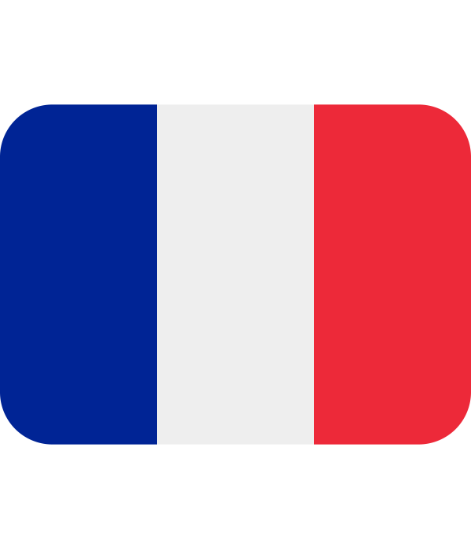

# > Hi there, I'm Antonin Ginet 🙋

### A full-stack engineer from 

Passionate 🥰 about creating technological solutions, I have expertise in all phases of the software development cycle 🔁. My commitment to quality code production 💪, my problem-solving skills 🧐 and my ability to adapt to different technologies, languages and frameworks make me a versatile and reliable professional 🤯. I am ✨ enthusiastic ✨ about contributing to stimulating environments and working in collaboration with motivated teams ❤️.

### 🤝 Connect with me:

### 👀 More about me

- 🔭 I’m currently working [@Karetis](https://www.linkedin.com/company/karetis)
- 🌱 I’m always trying to learn new cool stuffs
- 📫 How to reach me: [antonin.ginet98@gmail.com](mailto:antonin.ginet@gmail.com?subject=[GITHUB])

### 📈 My GitHub Stats

