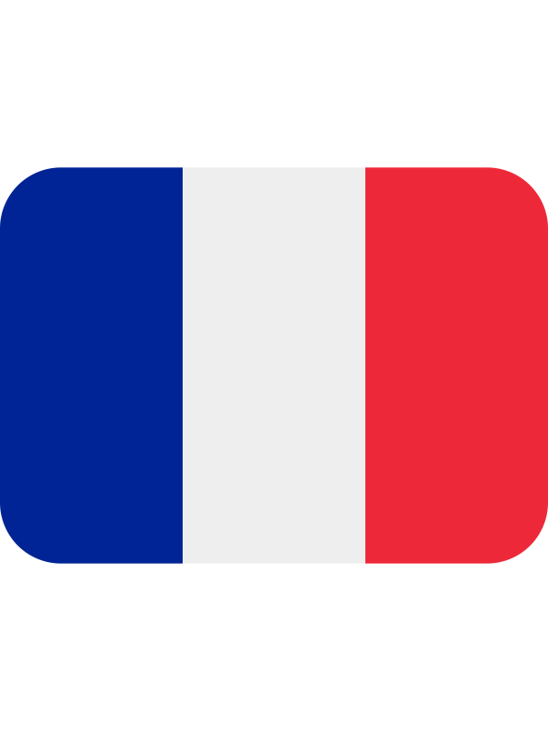

<h1 align="center">Hi 🙋 my name is Antonin Ginet</h1>
<h3 align="center">A passionate frontend developer from </h3>

<h3>Connect with me:</h3>

  
  
  
  

<h3>Languages:</h3>
<h3>Frameworks:</h3>
<h3>Databases:</h3>
<h3>Cloud:</h3>
<h3>Tools:</h3>
<h3>Operating systems:</h3>

  

<!--
**Ryubi98/Ryubi98** is a ✨ _special_ ✨ repository because its `README.md` (this file) appears on your GitHub profile.

Here are some ideas to get you started:

- 🔭 I’m currently working on ...
- 🌱 I’m currently learning ...
- 👯 I’m looking to collaborate on ...
- 🤔 I’m looking for help with ...
- 💬 Ask me about ...
- 📫 How to reach me: ...
- 😄 Pronouns: ...
- ⚡ Fun fact: ...
-->
